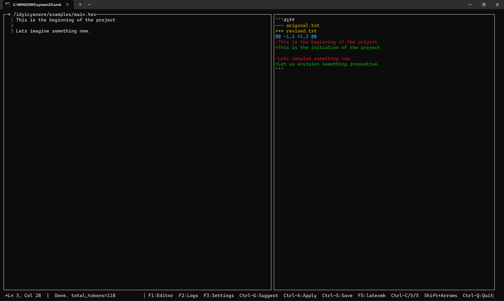
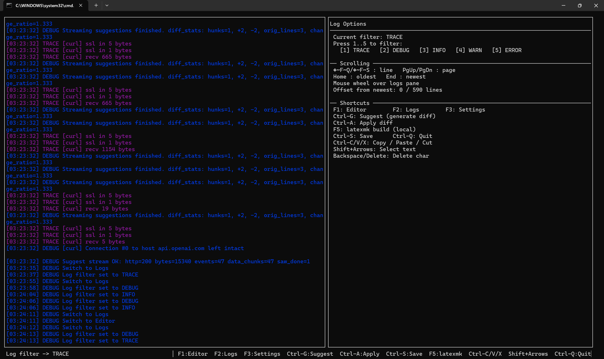

# idyicyanere

This console app helps to create books or scientific papaers quickly. 

## Start the container
docker run --name=idyicyanere --gpus all -it -v $PWD//:/idyicyanere debian:latest
docker exec -it idyicyanere /bin/bash

## Install dependencies
apt update -y
apt upgrade -y
apt install -y --no-install-recommends curl
apt install -y --no-install-recommends texlive texlive-latex-extra texlive-lang-spanish latexmk
apt install -y --no-install-recommends build-essential
apt install -y --no-install-recommends libncurses5-dev
apt install -y --no-install-recommends libcurl4-openssl-dev
apt install -y --no-install-recommends libjansson-dev
apt install -y --no-install-recommends openssh-client
apt install -y --no-install-recommends ca-certificates
update-ca-certificates

# Env
Create a .env file, base on example.env

# Build (optional)
cd idyicyanere/
make .

# Run the code

### Import the env variables
cd idyicyanere/
source .env

### Start the code
./idyicyanere examples/
